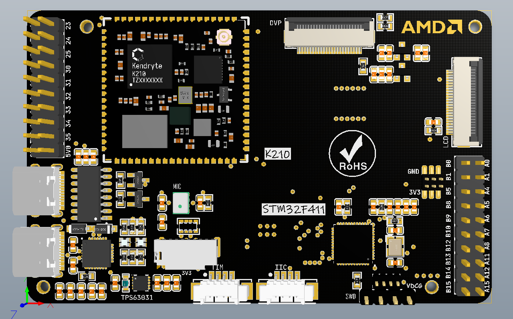

# Nexus K210: K210 和 STM32F411联合开发板

## 说明

1.使用的K210开发板是Sipeed 家的M1/M1w开发模块，其中M1w是带一个8266，可以连接WiFi进行上网的。

2.STM32芯片使用的是STM32F411CEU6，和K210用串口2进行通信。

3.两个TypeC，上面一个是K210的烧录、下载串口，使用CH340C芯片，下面一个是STM32的串口1通信，用的是CP2102芯片。

**最后，喜欢的话记得给仓库点星星，点个fork~**